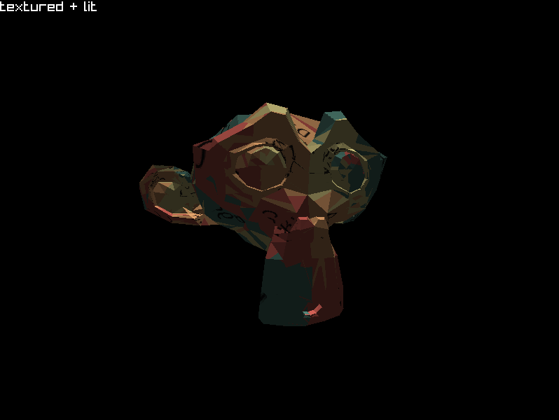

# Software Based .obj renderer

- Followed along with [Marian Pekar's Odin Software renderer series](https://www.marianpekar.com/) but implemented it in c++.
- Requires raylib to run, although I only use the window/input management and DrawPixel(), everything else is re-implemented. Lots of types are prefixed with J to avoid namespace collisions (almost certainly a smarter way to go about this).
- The cmake file should be evertything you need to run it, code in main.cpp should be quite self explainatory.
- UV mapping seems to be off, probably due to differences between odin mulitpointers and the Color* raylib returns.
- Also everything is in .h files I know i shouldn't do that but it works and I didn't feel like separating anything...
